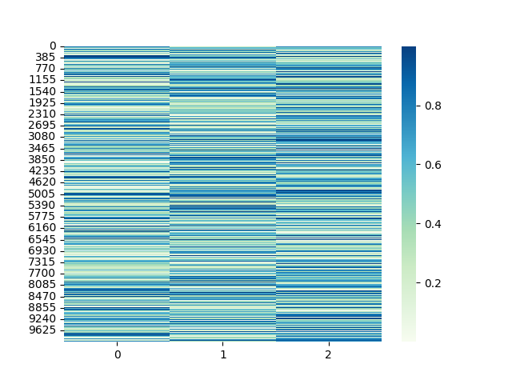
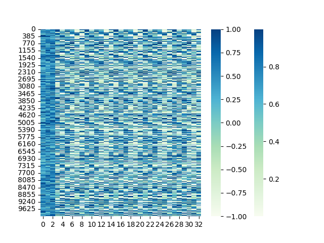
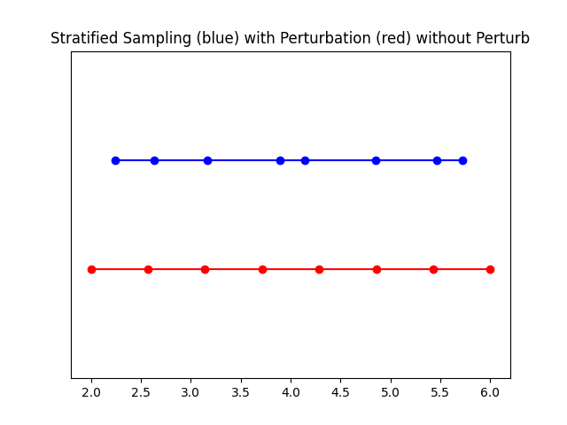

# NeRF
The NeRF (Neural Radiance Fields) is a method that achieves state-of-the-art results for synthesizing novel views of complex scenes.
## Method

[NeRF: Representing Scenes as Neural Radiance Fields for View Synthesis](http://tancik.com/nerf)  
 [Ben Mildenhall](https://people.eecs.berkeley.edu/~bmild/)\*1,
 [Pratul P. Srinivasan](https://people.eecs.berkeley.edu/~pratul/)\*1,
 [Matthew Tancik](http://tancik.com/)\*1,
 [Jonathan T. Barron](http://jonbarron.info/)2,
 [Ravi Ramamoorthi](http://cseweb.ucsd.edu/~ravir/)3,
 [Ren Ng](https://www2.eecs.berkeley.edu/Faculty/Homepages/yirenng.html)1  
 1UC Berkeley, 2Google Research, 3UC San Diego  
  \*denotes equal contribution  
  

> A neural radiance field is a simple fully connected network (weights are ~5MB) trained to reproduce input views of a single scene using a rendering loss. The network directly maps from spatial location and viewing direction (5D input) to color and opacity (4D output), acting as the "volume" so we can use volume rendering to differentiably render new views

# Table of Contents
[Theory Explanation](#TE)
   - [What is a NeRF](#NeRF)
   - [Origins and Directions](#OaD)
   - [Positional Encoder](#PE)
   - [Radiance Field Function-NeRF](#RFF)
   - [Differentiable Volume Renderer](#DVR)
   - [Stratified Sampling](#SS)
   - [Hierarchical Volume Sampling](#HVS)
[Usage](#Usage)

## What is a NeRF 
A neural radiance field (NeRF) is a neural network that can reconstruct complex three-dimensional scenes from a partial set of two-dimensional images. 
Three-dimensional images are required in various simulations, gaming, media, and Internet of Things (IoT) applications to make digital interactions more 
realistic and accurate. The NeRF learns the scene geometry, objects, and angles of a particular scene. Then it renders photorealistic 3D views from novel viewpoints, automatically generating synthetic data to fill in gaps.

### What are the use cases of neural radiance fields?
NeRFs can render complex scenes and generate images for various use cases.

#### Computer graphics and animation
In computer graphics, you can use NeRFs to create realistic visual effects, simulations, and scenes. NeRFs capture, render, and project lifelike environments, characters, and other imagery. NeRFs are commonly used to improve video-game graphics and VX film animation.

#### Medical imaging
NeRFs facilitate the creation of comprehensive anatomical structures from 2D scans such as MRIs. Their technology can reconstruct realistic representations of body tissue and organs, giving doctors and medical technicians useful visual context. 

#### Virtual reality
NeRFs are a vital technology in virtual reality and augmented reality simulations. Because they can accurately model 3D scenes, they facilitate creating and exploring realistic virtual environments. Depending on your viewing direction, the NeRF can display new visual information and even render virtual objects in a real space.

#### Satellite imagery and planning
Satellite imagery provides a range of images that NeRFs can use to produce comprehensive models of the earth’s surface. It is useful for reality capture (RC) use cases that require digitizing real-world environments—you can transform spatial location data into highly detailed 3D models. For example, the reconstruction of aerial imagery into landscape renders is commonly used in urban planning because it gives a useful reference for the real-world layout of an area. 

## Origins and Directions 

NeRF, or Neural Radiance Field, utilizes inputs from a grid of 3D positions (x, y, z) and view directions (θ, φ) 
to generate realistic 3D scenes. By employing inverse rendering on input images, we can obtain these crucial input points. 
This process involves drawing projection lines from each pixel across the 3D space, 
allowing us to sample points beyond the image boundaries. 
To do this, we start with the initial camera poses from the photo set and convert them into 3D coordinates and vectors, 
which together describe the camera's direction and origin during image capture, 
helping to expand our sampling range for more accurate scene representation.

  

With this camera pose, we can now find the projection lines along each pixel of our image. Each line is defined by its origin point (x,y,z) and its direction (in this case a 3D vector). While the origin is the same for every pixel, the direction is slightly different. These lines are slightly deflected off center such that none of these lines are parallel.

  

## Positional Encoder 
The NeRF model, similar to the transformer introduced in 2017, 
incorporates a positional encoder to benefit from higher-dimensional space representation. 
This technique uses high-frequency functions to help the model learn intricate details in the data, 
overcoming the neural network's inherent preference for lower frequency functions. Consequently, 
NeRF can create more precise and detailed representations.

Simple test of encoding-visualization

  

  

## Radiance Field Function-NeRF 

The NeRF model is defined here. It is mainly composed of a `ModuleList` of `Linear` layers, 
with the occasional residual connection and non-linear activation functions in between. 
This model has an optional view direction input that, if supplied during instantiation, will change the model design. 
Utilizing the same default settings, this solution is based on Section 3 of the original "NeRF: Representing Scenes as Neural Radiance Fields for View Synthesis" paper.

## Differentiable Volume Renderer 

It is still necessary to turn the raw NeRF outputs into a picture. 
This is the point in the paper where we apply the volume integration that is explained in Equations 1-3 in Section 4. 
To determine the estimated color value for a pixel, we essentially take the weighted sum of all samples along the pixel's ray. 
The alpha value of each RGB sample determines its weight. 
Points farther down the ray are more likely to be obscured because higher alpha values suggest a 
larger possibility that the sampled area is opaque. The damping of those additional points is guaranteed by 
the cumulative product.

## Stratified Sampling 

Having obtained the aforementioned lines, which are characterized as origin and direction vectors, 
we can now initiate the sampling procedure. It is important to remember that NeRF employs a coarse-to-fine sampling strategy, 
commencing with the stratified sampling approach.
The stratified sampling approach splits the ray into evenly-spaced bins and randomly samples within each bin. 
The perturb setting determines whether to sample points uniformly from each bin or to simply use the bin center as the point. 
In most cases, we want to keep perturb = True as it will encourage the network to learn over a continuously sampled space. 
It may be useful to disable for debugging.

  

## Hierarchical Volume Sampling 