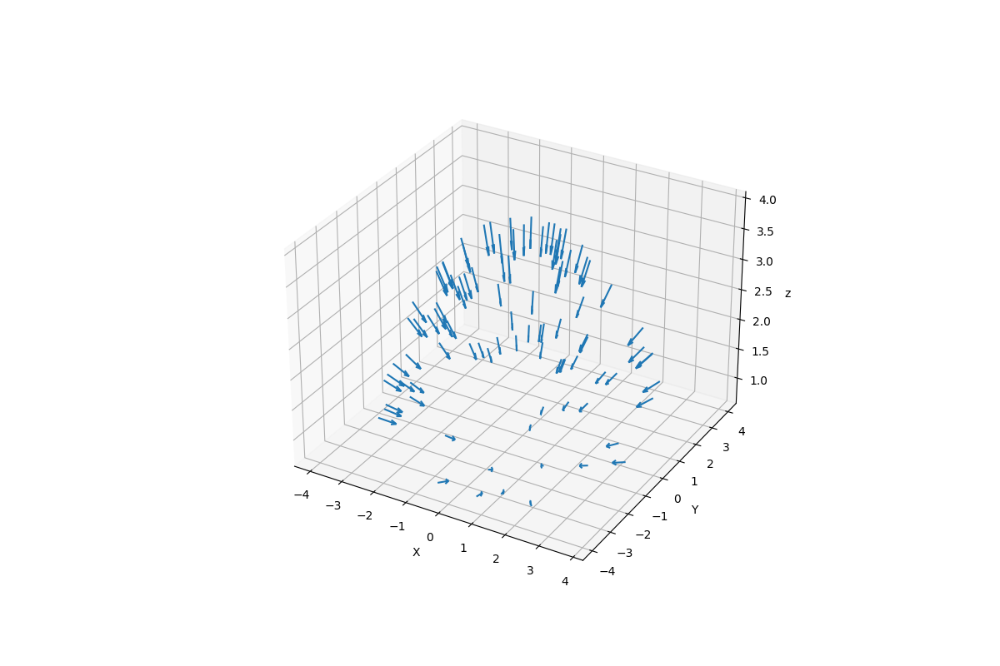
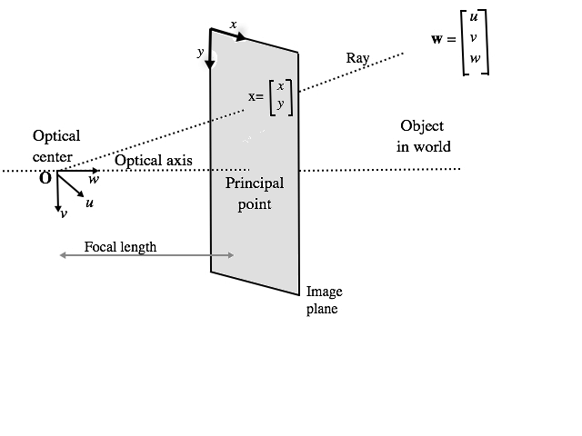

# NeRF
The NeRF (Neural Radiance Fields) is a method that achieves state-of-the-art results for synthesizing novel views of complex scenes.
## Method

[NeRF: Representing Scenes as Neural Radiance Fields for View Synthesis](http://tancik.com/nerf)  
 [Ben Mildenhall](https://people.eecs.berkeley.edu/~bmild/)\*1,
 [Pratul P. Srinivasan](https://people.eecs.berkeley.edu/~pratul/)\*1,
 [Matthew Tancik](http://tancik.com/)\*1,
 [Jonathan T. Barron](http://jonbarron.info/)2,
 [Ravi Ramamoorthi](http://cseweb.ucsd.edu/~ravir/)3,
 [Ren Ng](https://www2.eecs.berkeley.edu/Faculty/Homepages/yirenng.html)1  
 1UC Berkeley, 2Google Research, 3UC San Diego  
  \*denotes equal contribution  
  

> A neural radiance field is a simple fully connected network (weights are ~5MB) trained to reproduce input views of a single scene using a rendering loss. The network directly maps from spatial location and viewing direction (5D input) to color and opacity (4D output), acting as the "volume" so we can use volume rendering to differentiably render new views

# Table of Contents
[Theory Explanation](#TE)
   - [What is a NeRF](#NeRF)
   - [Origins and Directions](#OaD)
   - [Positional Encoder](#PE)
   - [Radiance Field Function-NeRF](#RFF)
   - [Differentiable Volume Renderer](#DVR)
   - [Stratified Sampling](#SS)
   - [Hierarchical Volume Sampling](#HVS)
[Usage](#Usage)

## What is a NeRF 
A neural radiance field (NeRF) is a neural network that can reconstruct complex three-dimensional scenes from a partial set of two-dimensional images. 
Three-dimensional images are required in various simulations, gaming, media, and Internet of Things (IoT) applications to make digital interactions more 
realistic and accurate. The NeRF learns the scene geometry, objects, and angles of a particular scene. Then it renders photorealistic 3D views from novel viewpoints, automatically generating synthetic data to fill in gaps.

### What are the use cases of neural radiance fields?
NeRFs can render complex scenes and generate images for various use cases.

#### Computer graphics and animation
In computer graphics, you can use NeRFs to create realistic visual effects, simulations, and scenes. NeRFs capture, render, and project lifelike environments, characters, and other imagery. NeRFs are commonly used to improve video-game graphics and VX film animation.

#### Medical imaging
NeRFs facilitate the creation of comprehensive anatomical structures from 2D scans such as MRIs. Their technology can reconstruct realistic representations of body tissue and organs, giving doctors and medical technicians useful visual context. 

#### Virtual reality
NeRFs are a vital technology in virtual reality and augmented reality simulations. Because they can accurately model 3D scenes, they facilitate creating and exploring realistic virtual environments. Depending on your viewing direction, the NeRF can display new visual information and even render virtual objects in a real space.

#### Satellite imagery and planning
Satellite imagery provides a range of images that NeRFs can use to produce comprehensive models of the earth’s surface. It is useful for reality capture (RC) use cases that require digitizing real-world environments—you can transform spatial location data into highly detailed 3D models. For example, the reconstruction of aerial imagery into landscape renders is commonly used in urban planning because it gives a useful reference for the real-world layout of an area. 

## Origins and Directions 

Recall that NeRF processes inputs from a field of positions (x,y,z) and view directions (θ,φ). To gather these input points, we need to apply inverse rendering to the input images. More concretely, we draw projection lines through each pixel and across the 3D space, from which we can draw samples.

To sample points from the 3D space beyond our image, we first start from the initial pose of every camera taken in the photo set. With some vector math, we can convert these 4x4 pose matrices into a 3D coordinate denoting the origin and a 3D vector indicating the direction. The two together describe a vector that indicates where a camera was pointing when the photo was taken.

The code in the cell below illustrates this by drawing arrows that depict the origin and the direction of every frame.

  

With this camera pose, we can now find the projection lines along each pixel of our image. Each line is defined by its origin point (x,y,z) and its direction (in this case a 3D vector). While the origin is the same for every pixel, the direction is slightly different. These lines are slightly deflected off center such that none of these lines are parallel.

  

## Positional Encoder 
Much like the transformer model introduced in 2017[11], 
the NeRF also benefits from a positional encoder as its input, albeit for a different reason. 
In short, it maps its continuous input to a higher-dimensional space using high-frequency functions to aid 
the model in learning high frequency variations in the data, which leads to sharper models. 
This approach circumvents the bias that neural networks have towards lower frequency functions, 
allowing NeRF to represent sharper details.

## Radiance Field Function-NeRF 
## Differentiable Volume Renderer 
## Stratified Sampling 
## Hierarchical Volume Sampling 